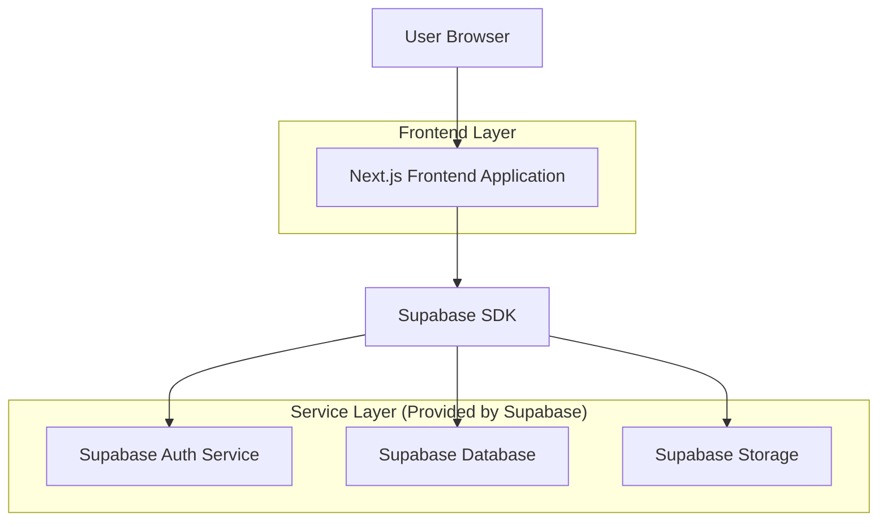
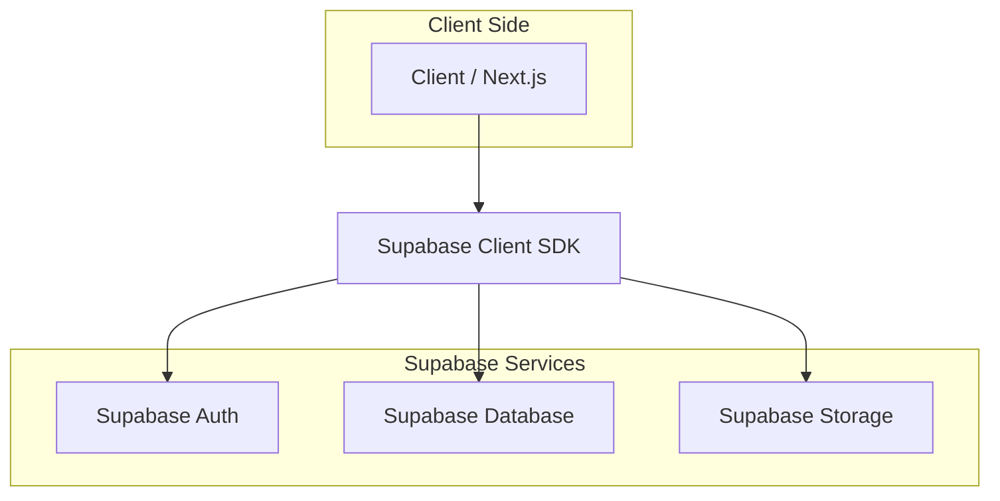
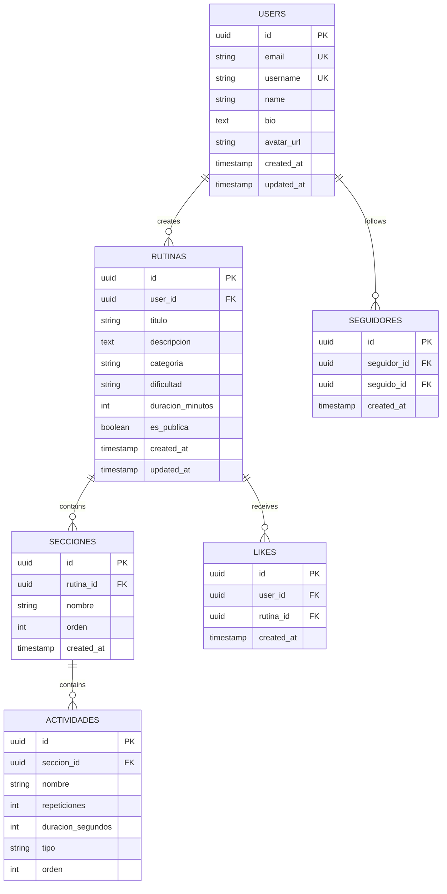

## 1. Architecture design



## 2. Technology Description
- **Frontend**: Next.js@14 + React@18 + TypeScript + TailwindCSS
- **Backend**: Supabase (Auth + PostgreSQL + Storage)
- **Initialization Tool**: create-next-app
- **UI Components**: shadcn/ui o HeadlessUI
- **Estado global**: Context API o Zustand

## 3. Route definitions
| Route | Purpose |
|-------|---------|
| / | Tablón principal, feed de rutinas de usuarios seguidos |
| /explorar | Página de exploración de rutinas públicas |
| /perfil/[username] | Perfil público de usuario |
| /perfil | Mi perfil personal y mis rutinas |
| /crear-rutina | Formulario para crear nueva rutina |
| /rutina/[id] | Vista detallada de una rutina específica |
| /auth/login | Página de inicio de sesión |
| /auth/register | Página de registro de nuevo usuario |

## 4. API definitions

### 4.1 Core API

**Autenticación con Supabase**
```typescript
// Login con Supabase
const { data, error } = await supabase.auth.signInWithPassword({
  email: string,
  password: string
})

// Register con Supabase
const { data, error } = await supabase.auth.signUp({
  email: string,
  password: string,
  options: {
    data: {
      username: string,
      name: string
    }
  }
})
```

**Rutinas API**
```typescript
// Obtener rutinas del feed (usuarios seguidos)
GET /api/rutinas/feed
Response: {
  rutinas: Rutina[],
  nextCursor?: string
}

// Explorar rutinas públicas
GET /api/rutinas/explorar?search=&categoria=&dificultad=
Response: {
  rutinas: Rutina[],
  total: number
}

// Crear nueva rutina
POST /api/rutinas
Body: {
  titulo: string,
  descripcion: string,
  secciones: Seccion[]
}
```

## 5. Server architecture diagram



## 6. Data model

### 6.1 Data model definition


### 6.2 Data Definition Language

**Tabla de usuarios**
```sql
-- create table
CREATE TABLE users (
    id UUID PRIMARY KEY DEFAULT gen_random_uuid(),
    email VARCHAR(255) UNIQUE NOT NULL,
    username VARCHAR(50) UNIQUE NOT NULL,
    name VARCHAR(100) NOT NULL,
    bio TEXT,
    avatar_url TEXT,
    created_at TIMESTAMP WITH TIME ZONE DEFAULT NOW(),
    updated_at TIMESTAMP WITH TIME ZONE DEFAULT NOW()
);

-- create index
CREATE INDEX idx_users_username ON users(username);
CREATE INDEX idx_users_email ON users(email);
```

**Tabla de rutinas**
```sql
-- create table
CREATE TABLE rutinas (
    id UUID PRIMARY KEY DEFAULT gen_random_uuid(),
    user_id UUID REFERENCES users(id) ON DELETE CASCADE,
    titulo VARCHAR(200) NOT NULL,
    descripcion TEXT,
    categoria VARCHAR(50) CHECK (categoria IN ('cardio', 'fuerza', 'flexibilidad', 'mixta')),
    dificultad VARCHAR(20) CHECK (dificultad IN ('principiante', 'intermedio', 'avanzado')),
    duracion_minutos INTEGER,
    es_publica BOOLEAN DEFAULT true,
    created_at TIMESTAMP WITH TIME ZONE DEFAULT NOW(),
    updated_at TIMESTAMP WITH TIME ZONE DEFAULT NOW()
);

-- create index
CREATE INDEX idx_rutinas_user_id ON rutinas(user_id);
CREATE INDEX idx_rutinas_categoria ON rutinas(categoria);
CREATE INDEX idx_rutinas_publicas ON rutinas(es_publica) WHERE es_publica = true;
```

**Tabla de secciones**
```sql
-- create table
CREATE TABLE secciones (
    id UUID PRIMARY KEY DEFAULT gen_random_uuid(),
    rutina_id UUID REFERENCES rutinas(id) ON DELETE CASCADE,
    nombre VARCHAR(100) NOT NULL,
    orden INTEGER NOT NULL,
    created_at TIMESTAMP WITH TIME ZONE DEFAULT NOW()
);

-- create index
CREATE INDEX idx_secciones_rutina_id ON secciones(rutina_id);
```

**Tabla de actividades**
```sql
-- create table
CREATE TABLE actividades (
    id UUID PRIMARY KEY DEFAULT gen_random_uuid(),
    seccion_id UUID REFERENCES secciones(id) ON DELETE CASCADE,
    nombre VARCHAR(100) NOT NULL,
    repeticiones INTEGER,
    duracion_segundos INTEGER,
    tipo VARCHAR(50) CHECK (tipo IN ('repeticiones', 'tiempo', 'descanso')),
    orden INTEGER NOT NULL,
    created_at TIMESTAMP WITH TIME ZONE DEFAULT NOW()
);

-- create index
CREATE INDEX idx_actividades_seccion_id ON actividades(seccion_id);
```

**Tabla de seguidores**
```sql
-- create table
CREATE TABLE seguidores (
    id UUID PRIMARY KEY DEFAULT gen_random_uuid(),
    seguidor_id UUID REFERENCES users(id) ON DELETE CASCADE,
    seguido_id UUID REFERENCES users(id) ON DELETE CASCADE,
    created_at TIMESTAMP WITH TIME ZONE DEFAULT NOW(),
    UNIQUE(seguidor_id, seguido_id)
);

-- create index
CREATE INDEX idx_seguidores_seguidor ON seguidores(seguidor_id);
CREATE INDEX idx_seguidores_seguido ON seguidores(seguido_id);
```

**Tabla de likes**
```sql
-- create table
CREATE TABLE likes (
    id UUID PRIMARY KEY DEFAULT gen_random_uuid(),
    user_id UUID REFERENCES users(id) ON DELETE CASCADE,
    rutina_id UUID REFERENCES rutinas(id) ON DELETE CASCADE,
    created_at TIMESTAMP WITH TIME ZONE DEFAULT NOW(),
    UNIQUE(user_id, rutina_id)
);

-- create index
CREATE INDEX idx_likes_user ON likes(user_id);
CREATE INDEX idx_likes_rutina ON likes(rutina_id);
```

**Políticas de Supabase**
```sql
-- Permisos básicos para usuarios anónimos
GRANT SELECT ON users TO anon;
GRANT SELECT ON rutinas TO anon;
GRANT SELECT ON secciones TO anon;
GRANT SELECT ON actividades TO anon;

-- Permisos completos para usuarios autenticados
GRANT ALL PRIVILEGES ON users TO authenticated;
GRANT ALL PRIVILEGES ON rutinas TO authenticated;
GRANT ALL PRIVILEGES ON secciones TO authenticated;
GRANT ALL PRIVILEGES ON actividades TO authenticated;
GRANT ALL PRIVILEGES ON seguidores TO authenticated;
GRANT ALL PRIVILEGES ON likes TO authenticated;

-- Políticas RLS (Row Level Security)
-- Las rutinas públicas pueden ser vistas por todos
CREATE POLICY "Rutinas públicas visibles" ON rutinas
    FOR SELECT USING (es_publica = true);

-- Los usuarios solo pueden ver sus propias rutinas privadas
CREATE POLICY "Rutinas propias visibles" ON rutinas
    FOR SELECT USING (auth.uid() = user_id);
```