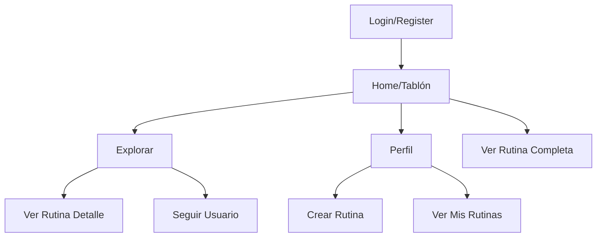

## 1. Product Overview
Red social especializada en compartir rutinas de entrenamiento. Los usuarios pueden crear, publicar y descubrir rutinas de otros usuarios. El producto resuelve la necesidad de encontrar inspiración y variedad en los entrenamientos, permitiendo a los usuarios compartir sus rutinas personales y descubrir nuevas de otros entrenadores.

## 2. Core Features

### 2.1 User Roles
| Role | Registration Method | Core Permissions |
|------|---------------------|------------------|
| Usuario Registrado | Email y contraseña | Crear rutinas, publicar, seguir usuarios, comentar |
| Usuario Anónimo | Navegación sin registro | Ver rutinas públicas, explorar contenido |

### 2.2 Feature Module
La red social consta de las siguientes páginas principales:
1. **Tablón**: Muestra las publicaciones de usuarios que sigues con sus rutinas de entrenamiento.
2. **Explorar**: Descubre rutinas de usuarios que no sigues, con filtros y búsqueda.
3. **Perfil**: Tu información personal y todas tus rutinas publicadas con opción de crear nuevas.

### 2.3 Page Details
| Page Name | Module Name | Feature description |
|-----------|-------------|---------------------|
| Tablón | Feed de rutinas | Mostrar publicaciones cronológicamente. Cada publicación muestra autor, título, descripción breve y botón desplegable para ver secciones y actividades |
| Tablón | Interacciones | Botón de like y contador de likes por publicación |
| Explorar | Búsqueda | Barra de búsqueda por título de rutina o nombre de usuario |
| Explorar | Filtros | Filtrar por categoría de ejercicio, duración estimada, dificultad |
| Explorar | Grid de rutinas | Visualización en cuadrícula de tarjetas de rutinas con preview de información básica |
| Perfil | Info de usuario | Mostrar nombre, foto de perfil, bio, contador de rutinas y seguidores |
| Perfil | Mis rutinas | Listado de todas las rutinas creadas por el usuario con opción de editar o eliminar |
| Perfil | Crear rutina | Formulario para crear nueva rutina con título, descripción, secciones y actividades |
| Perfil | Seguidores/Siguiendo | Lista de usuarios que sigues y que te siguen |

## 3. Core Process
### Flujo de Usuario Registrado:
1. Usuario se registra con email y contraseña
2. Completa su perfil con nombre y foto opcional
3. Puede explorar rutinas sin seguir a nadie
4. Sigue a otros usuarios para ver sus rutinas en el tablón
5. Crea sus propias rutinas con secciones y actividades
6. Publica rutinas que aparecen en el perfil y tablón de seguidores

### Flujo de Creación de Rutina:
1. Desde el perfil, click en "Nueva Rutina"
2. Completa título y descripción
3. Agrega secciones (ej: "Calentamiento", "Cardio", "Fuerza")
4. Para cada sección, agrega actividades con nombre, repeticiones y tiempo
5. Guarda y publica la rutina

## 4. User Interface Design

### 4.1 Design Style
- **Colores primarios**: Azul deportivo (#2563EB) y blanco
- **Colores secundarios**: Gris claro (#F3F4F6) y verde éxito (#10B981)
- **Botones**: Estilo redondeado con sombra sutil, hover effects
- **Tipografía**: Inter o Roboto, tamaños 14-18px para contenido, 24-32px para títulos
- **Layout**: Card-based con navegación superior fija
- **Iconos**: Estilo outline deportivo, posiblemente de Heroicons

### 4.2 Page Design Overview
| Page Name | Module Name | UI Elements |
|-----------|-------------|-------------|
| Tablón | Feed cards | Tarjetas de rutina con imagen de fondo deportiva, avatar circular del autor, título en negrita, descripción de 2 líneas, botón desplegable para secciones |
| Explorar | Grid layout | Cuadrícula responsive 3 columnas desktop, 2 tablet, 1 móvil. Tarjetas más compactas que el feed |
| Perfil | Header | Banner deportivo, avatar circular grande, stats en fila (rutinas, seguidores, siguiendo) |
| Crear Rutina | Form | Inputs limpios con labels, botón "+ Agregar Sección", secciones colapsables con actividades listadas |

### 4.3 Responsiveness
Diseño desktop-first con adaptación mobile. Navegación superior se convierte en menú hamburguesa en móvil. Grid de explorar se ajusta a 1 columna en móviles. Touch optimizado para desplegables y scroll.